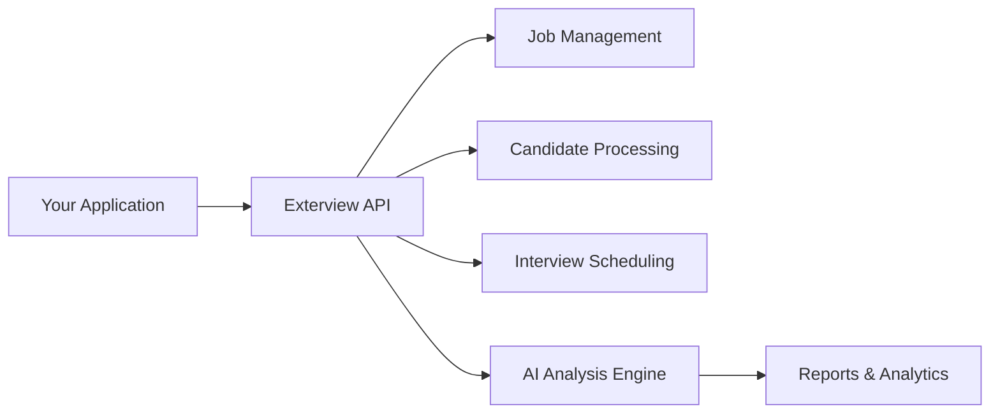

## Welcome to the Exterview API

The Exterview API empowers developers and partner platforms to seamlessly integrate advanced hiring, assessment, and AI interview capabilities into their own systems.

Built for scalability and automation, the API provides secure access to Exterview's intelligent recruitment ecosystem from job creation and candidate management to AI-driven interviews and analytics.

## What You Can Build

<CardGroup cols={2}>
  <Card title="Job Management" icon="briefcase">
    Create and manage job postings with automated parsing from PDF,DOCX,TXT files
  </Card>
  <Card title="Candidate Operations" icon="users">
    Bulk upload resumes with AI-powered parsing, scoring, and skills extraction
  </Card>
  <Card title="Interview Scheduling" icon="calendar">
    Schedule and manage interviews with automated assignment and notifications
  </Card>
  <Card title="Analytics & Reports" icon="chart-line">
    Access leaderboards, interview reports, and detailed candidate assessments
  </Card>
</CardGroup>

## Key Features

<AccordionGroup>
  <Accordion title="AI-Powered Resume Parsing" icon="robot">
    Automatically extract candidate information, skills, experience, and education from resumes in multiple formats (PDF, DOC, DOCX). Our AI engine scores candidates against job requirements and provides detailed skill matching.
  </Accordion>

  <Accordion title="Intelligent Scoring System" icon="star">
    Leverage both AI-generated and manual scoring systems to rank candidates. Customize scoring criteria based on experience, skills, education, and more to find the perfect fit for each role.
  </Accordion>

  <Accordion title="GraphQL & REST APIs" icon="code">
    Use our flexible GraphQL endpoint for complex queries and mutations, or REST endpoints for file uploads. Get exactly the data you need with efficient, well-documented APIs.
  </Accordion>

  <Accordion title="Real-time Interview Reports" icon="file-text">
    Access comprehensive interview reports including AI feedback, question-answer transcripts, video playback links, and detailed performance analytics.
  </Accordion>

  <Accordion title="Scalable Infrastructure" icon="server">
    Built to handle high-volume recruitment operations with rate limiting, pagination, and bulk operations support. Production and sandbox environments available.
  </Accordion>
</AccordionGroup>

## Quick Start

Get started with the Exterview API in minutes:

<Steps>
  <Step title="Get Your Credentials">
    Obtain your API key and Bearer token from the Exterview dashboard. See [Authentication](/api-reference/getting-started/authentication) for details.
  </Step>
  
  <Step title="Make Your First Request">
    Test your authentication with a simple GraphQL query:
    
    ```bash
    curl -X POST https://api.exterview.ai/graphql \
      -H "x-api-key: YOUR_API_KEY" \
      -H "Authorization: Bearer YOUR_TOKEN" \
      -H "Content-Type: application/json" \
      -d '{"query": "query { __typename }"}'
    ```
  </Step>
  
  <Step title="Create Your First Job">
    Upload a job posting and start receiving candidates. Check out [Create Job](/api-reference/jobs/create-job).
  </Step>
  
  <Step title="Upload Candidates">
    Bulk upload candidate resumes for automated processing. See [Bulk Upload](/api-reference/candidates/bulk-upload).
  </Step>
</Steps>

## API Architecture

The Exterview API is built on a modern, scalable architecture:



### Base URLs

<CodeGroup>

```bash Production
https://api.exterview.ai/graphql
```

```bash Sandbox
https://sandbox-api.exterview.ai/graphql
```

</CodeGroup>

## Core Capabilities

### 1. Job Management

Create and manage job postings with ease:
- Upload job definitions from PDF,DOCX or TXT files
- AI-powered parsing with custom prompts
- Draft and published job states
- Search and filter capabilities

[Explore Job APIs →](/api-reference/jobs/create-job)

### 2. Candidate Management

Streamline your candidate pipeline:
- Bulk resume uploads (PDF, DOC, DOCX)
- Automated information extraction
- Customizable scoring criteria
- Duplicate detection
- Skills matching against job requirements

[Explore Candidate APIs →](/api-reference/candidates/bulk-upload)

### 3. Interview Scheduling

Manage interviews efficiently:
- Assign interviewers to candidates
- Schedule with conflict detection
- Automated reminders
- Status tracking

[Explore Interview APIs →](/api-reference/interviews/schedule-interview)

### 4. Reports & Analytics

Make data-driven hiring decisions:
- AI and manual candidate leaderboards
- Detailed interview reports with AI feedback
- Video playback access
- Question-answer transcripts
- Performance metrics

[Explore Report APIs →](/api-reference/reports/get-leaderboard)


## Rate Limits

To ensure fair usage and system stability:

- **Default Limit**: 600 requests per minute per organization
- **Pagination**: Use `pageNum` and `perPage` for large datasets
- **Bulk Operations**: Recommended for high-volume operations

<Info>
Rate limit headers are included in every response to help you track your usage.
</Info>

## SDK & Libraries

While we don't provide official SDKs yet, our API is compatible with standard HTTP clients:

<CodeGroup>

```javascript JavaScript/Node.js
// Using fetch API
const response = await fetch('https://api.exterview.ai/graphql', {
  method: 'POST',
  headers: {
    'x-api-key': process.env.EXTERVIEW_API_KEY,
    'Authorization': `Bearer ${process.env.EXTERVIEW_TOKEN}`,
    'Content-Type': 'application/json'
  },
  body: JSON.stringify({ query: '...' })
});
```

```python Python
# Using requests library
import requests

response = requests.post(
    'https://api.exterview.ai/graphql',
    headers={
        'x-api-key': os.getenv('EXTERVIEW_API_KEY'),
        'Authorization': f'Bearer {os.getenv("EXTERVIEW_TOKEN")}',
        'Content-Type': 'application/json'
    },
    json={'query': '...'}
)
```

```bash cURL
curl -X POST https://api.exterview.ai/graphql \
  -H "x-api-key: $EXTERVIEW_API_KEY" \
  -H "Authorization: Bearer $EXTERVIEW_TOKEN" \
  -H "Content-Type: application/json" \
  -d '{"query": "..."}'
```

</CodeGroup>

## Best Practices

<CardGroup cols={2}>
  <Card title="Use Environment Variables" icon="shield">
    Never hardcode credentials. Use environment variables for API keys and tokens.
  </Card>
  <Card title="Implement Error Handling" icon="triangle-exclamation">
    Always handle errors gracefully with proper retry logic and exponential backoff.
  </Card>
  <Card title="Paginate Large Results" icon="list">
    Use pagination for queries that return many results to optimize performance.
  </Card>
  <Card title="Monitor Rate Limits" icon="gauge">
    Check rate limit headers and implement appropriate throttling in your application.
  </Card>
</CardGroup>

## Use Cases

### Applicant Tracking Systems (ATS)
Integrate Exterview's AI capabilities into your existing ATS to enhance candidate screening and evaluation.

### Recruitment Platforms
Build comprehensive recruitment solutions with automated interview scheduling and AI-driven assessments.

### HR Management Systems
Add intelligent hiring workflows to your HRMS with seamless candidate management and analytics.

### Job Boards
Enhance job board functionality with AI-powered candidate matching and automated screening.

## Support & Resources

<CardGroup cols={2}>
  <Card title="API Reference" icon="book" href="/api-reference/jobs/create-job">
    Detailed documentation for all API endpoints
  </Card>
  <Card title="Authentication Guide" icon="key" href="/api-reference/getting-started/authentication">
    Learn how to authenticate your API requests
  </Card>
  <Card title="Contact Support" icon="envelope">
    Email us at support@exterview.ai
  </Card>
  <Card title="System Status" icon="signal">
    Check status.exterview.ai for uptime
  </Card>
</CardGroup>

## What's Next?

Ready to start building? Here are your next steps:

1. **[Set up Authentication](/getting-started/authentication)** - Get your API credentials
2. **[Create Your First Job](/api-reference/jobs/create-job)** - Start posting positions
3. **[Upload Candidates](/api-reference/candidates/bulk-upload)** - Begin candidate processing
4. **[Explore Reports](/api-reference/reports/get-leaderboard)** - Access analytics and insights

<Check>
**Ready to transform your recruitment process?** Let's get started with the Exterview API!
</Check>