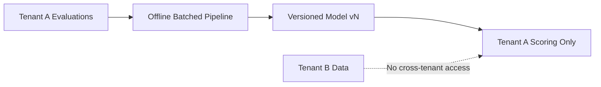

## Who this is for

Microsoft architects, enterprise buyers, and security teams evaluating Exterview's primary differentiator.

## The model

Exterview's **per-tenant compounding model** improves scoring quality within each organization based on that organization's own evaluation outcomes. This is **not** a generic cross-industry skills graph.

### Key guarantees

1. **Per-tenant only** — Compounding occurs within a single tenant's data boundary. No cross-tenant data or model bleed.
2. **Offline and batched** — Learning runs offline in batched pipelines, not as live, unaudited in-session adaptation.
3. **Versioned** — Every compounding update produces a new model version with full audit trail.
4. **Auditable** — Compounding artifacts are versioned and traceable; there is no live black-box learning during evaluations.

## Why this matters

| Generic skills graph | Exterview per-tenant compounding |
|---------------------|----------------------------------|
| Cross-org data pooling | Strict per-tenant isolation |
| Opaque global model | Versioned, auditable tenant models |
| One-size-fits-all scoring | Org-specific evaluation improvement |
| Live adaptation risk | Offline, batched, reviewable updates |

## Consistency with Trust & Compliance

Per-tenant isolation claims on this page are consistent with:

- [Multi-tenancy & data isolation](/concepts/multi-tenancy-data-isolation)
- [Platform coverage & residency](/trust-compliance/platform-coverage-residency)
- [Responsible AI](/trust-compliance/responsible-ai)

## Next steps

<CardGroup cols={2}>
  <Card title="Multi-tenancy" icon="building" href="/concepts/multi-tenancy-data-isolation">
    Partitioning and isolation architecture.
  </Card>
  <Card title="Scoring methodology" icon="chart-line" href="/concepts/scoring-methodology">
    How signals become scores today.
  </Card>
</CardGroup>
