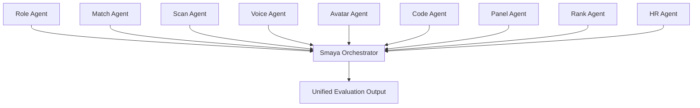

## Who this is for

Enterprise architects, Microsoft stakeholders, and technical buyers evaluating Exterview's design depth and Azure alignment.

## Architecture overview

Exterview's evaluation engine is built on **nine specialized agents** coordinated by **Smaya**, a supervisor orchestrator. Each agent owns a distinct responsibility in the evaluation pipeline.

## Design principles

- **Specialized agents** — Each agent handles one evaluation capability with clear boundaries.
- **Supervisor orchestration** — Smaya coordinates agent execution, sequencing, and result aggregation.
- **Per-tenant isolation** — All agent outputs and model artifacts are partitioned by tenant.
- **Azure-native** — Platform infrastructure runs on Azure regions with Microsoft ecosystem integrations.

## Agent summary

| Agent | Responsibility |
|-------|----------------|
| **Role** | Creates and structures job roles from JD files, prompts, or manual input. |
| **Match** | Sources, ranks, and qualifies candidates against role requirements. |
| **Scan** | Parses resumes and extracts structured candidate signals. |
| **Voice** | Conducts AI-led voice interviews with transcripts and scoring. |
| **Avatar** | Conducts video-avatar interviews with integrity and consent flows. |
| **Code** | Evaluates technical skills through coding assessments. |
| **Panel** | Supports multi-interviewer panel evaluation workflows. |
| **Rank** | Aggregates signals into ranked candidate outcomes. |
| **HR** | Handles HR workflow coordination and compliance-aware operations. |

[See detailed agent roles →](/concepts/agent-roles)

## Related documentation

<CardGroup cols={2}>
  <Card title="Agent roles" icon="robot" href="/concepts/agent-roles">
    Plain-language description of each agent.
  </Card>
  <Card title="Scoring methodology" icon="chart-line" href="/concepts/scoring-methodology">
    How agent signals become scores.
  </Card>
  <Card title="Multi-tenancy" icon="building" href="/concepts/multi-tenancy-data-isolation">
    Data isolation and partitioning guarantees.
  </Card>
  <Card title="M365 / Teams" icon="microsoft" href="/integrations/m365-teams">
    Microsoft ecosystem integration.
  </Card>
</CardGroup>
